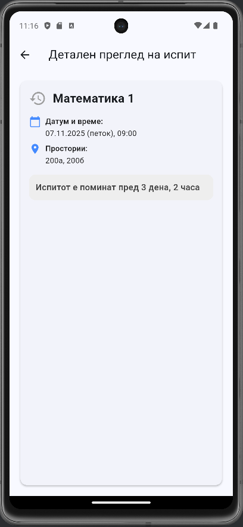
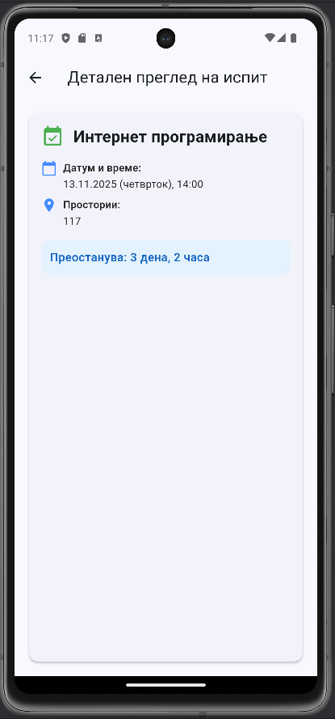

# 📘 Распоред на испити

Flutter апликација за прикажување на **распоред на испити**, со детални информации за секој испит, преостанато време до терминот и визуелна разлика помеѓу идни и поминати испити.

---

## 📱 Функционалности

### 1. Почетен екран — *Листа на испити*
- Прикажува **список од најмалку 10 испити** во **Card** формат.
- Секој испит содржи:
    - Име на предмет
    - Датум и време
    - Простории каде што се одржува
- Дизајнот вклучува:
    - Икони за испит (различни за идни и поминати)
    - Различни бои за завршени и претстојни испити
    - Беџ на дното со **вкупниот број на испити**
- Испитите се **сортирани хронолошки** по датум.
- Наслов во AppBar:  
  **„Распоред на испити — [број на индекс]“**  
  пример: `Распоред на испити — 223091`

---

### 2. Детален преглед — *Екран за поединечен испит*
- При клик на испит од листата се отвора нов екран.
- Прикажани информации:
    - Предмет
    - Датум и време (форматирани на македонски)
    - Простории
    - Преостанато време до испит (или порака дека испитот е поминат)
- Формат за време:  
  **„X дена, Y часа“**
- Визуелна разлика меѓу поминати и идни испити (икони и бои).

---

### 3. Модел — *Exam*
Моделот `Exam` се наоѓа во `models/exam_model.dart` и ги содржи следните полиња:
```dart
class Exam {
  final String subject;          // Име на предмет
  final DateTime dateTime;       // Датум и време на испит
  final List<String> classrooms; // Простории
}
```
Дополнителни гетери:
- isPast → проверува дали испитот е веќе завршен
- timeUntil → пресметува преостанато време до испитот

---

### Технички барања и структура

- Користени статички податоци (hardcoded листа на испити)
- Named параметри во конструктори
- Кодот е организиран по фолдери:

```
lib/
│
├── models/
│   └── exam_model.dart
│
├── screens/
│   ├── home.dart        // Главен екран со листа на испити
│   └── details.dart     // Детален преглед на избран испит
│
├── widgets/
│   └── exam_card.dart   // Дизајн на поединечна картица за испит
│
└── main.dart            // Главен влез во апликацијата
```

---

### Визуелни карактеристики

- Card дизајн со Rounded Corners и InkWell ефект при клик.
- Различни бои и икони за минати и идни испити.
- Chip компоненти за прикажување на простории.
- Прегледен и минималистички Material 3 стил.

### Користени библиотеки

- flutter/material.dart - Основен Flutter UI toolkit
- intl - Форматирање на датуми на македонски (mk_MK)

---

### Пример од код

Прикажување на испит во листа:
```dart
ExamCard(
  exam: exam,
  onTap: () {
    Navigator.push(
      context,
      MaterialPageRoute(
        builder: (_) => ExamDetailsScreen(exam: exam),
      ),
    );
  },
)
```
Преостанато време до испит:
```dart
String _remainingHuman(Duration diff, {bool past = false}) {
  var d = diff.inDays;
  var h = diff.inHours - d * 24;
  return past ? 'Испитот е поминат пред $d дена, $h часа'
              : 'Преостанува: $d дена, $h часа';
}
```

---

## 📸 Screenshots





---

### Автор

- Име и презиме: Никола Сарафимов
- Број на индекс: 223091
- Предмет: Мобилни информациски системи
- Година: 2025/26